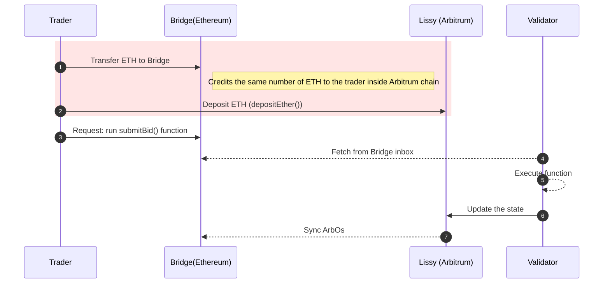

```mermaid
sequenceDiagram
autonumber
participant Trader
participant Bridge(Ethereum)
participant Lissy (Arbitrum)
participant Validator
rect rgb(255, 0, 0, 0.1)
Trader->>Bridge(Ethereum): Transfer ETH to Bridge
Note right of Bridge(Ethereum): Credits the same number of ETH to the trader inside Arbitrum chain
Trader->>Lissy (Arbitrum): Deposit ETH (depositEther())
end
Trader->>Bridge(Ethereum): Request: run submitBid() function
Validator-->>Bridge(Ethereum): Fetch from Bridge inbox
Validator-->>Validator: Execute function
Validator->>Lissy (Arbitrum):Update the state
Lissy (Arbitrum)-->>Bridge(Ethereum): Sync ArbOs
```
