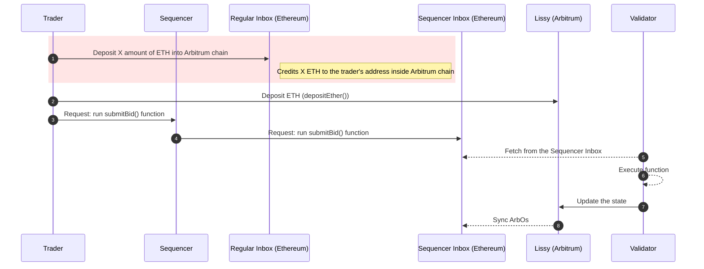

```mermaid
sequenceDiagram
autonumber
participant Trader
participant Sequencer
participant Regular Inbox (Ethereum)
participant Sequencer Inbox (Ethereum)
participant Lissy (Arbitrum)
participant Validator
rect rgb(255, 0, 0, 0.1)
Trader->>Regular Inbox (Ethereum): Deposit X amount of ETH into Arbitrum chain
Note right of Regular Inbox (Ethereum): Credits X ETH to the trader's address inside Arbitrum chain
end
Trader->>Lissy (Arbitrum): Deposit ETH (depositEther())

Trader->>Sequencer: Request: run submitBid() function
Sequencer->>Sequencer Inbox (Ethereum):Request: run submitBid() function
Validator-->>Sequencer Inbox (Ethereum): Fetch from the Sequencer Inbox
Validator-->>Validator: Execute function
Validator->>Lissy (Arbitrum):Update the state
Lissy (Arbitrum)-->>Sequencer Inbox (Ethereum): Sync ArbOs
```
